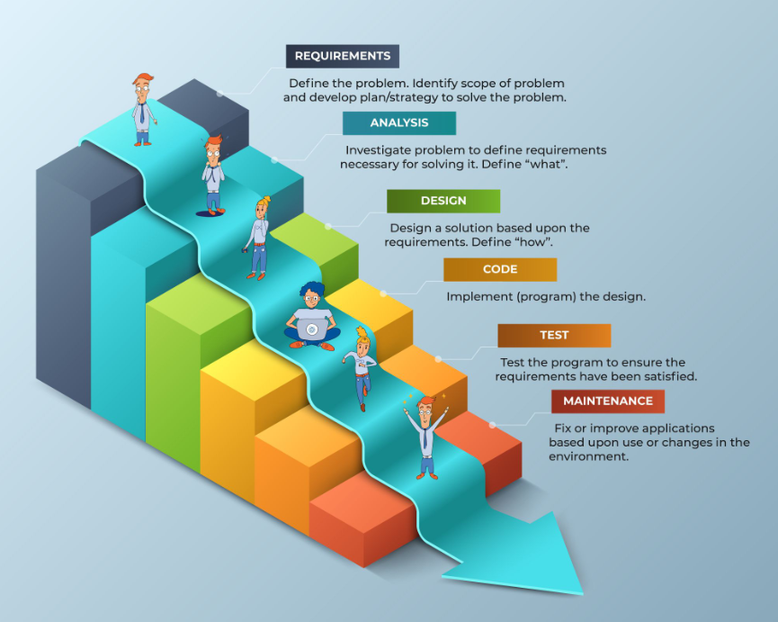
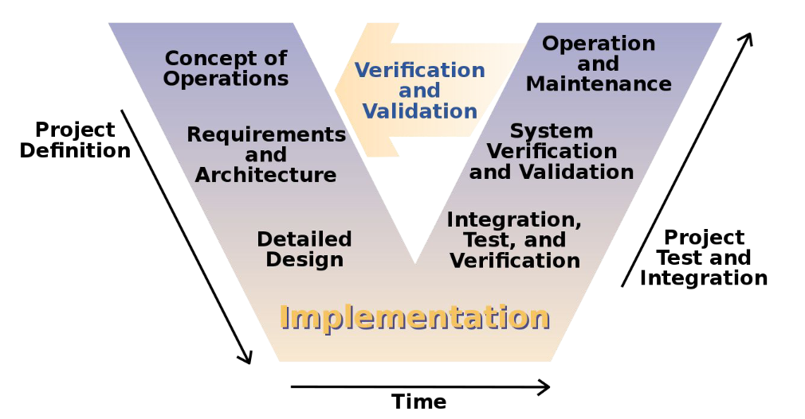
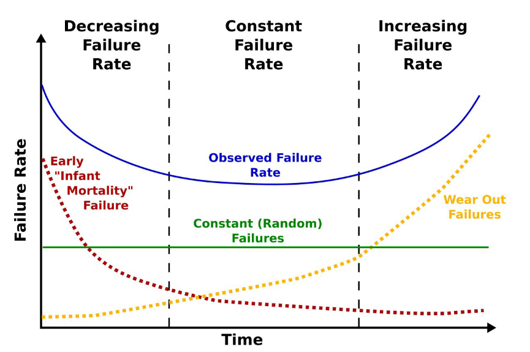

# DevOps

Objectifs:

- Comprendre les concepts du DevOps
- Comprendre pourquoi on est arrivé au DevOps ?

## Les mauvais élèves de la qualité logicielle

- Ariane 5
- Boeing Crew Space Transportation-100 Starliner

## L'avant DevOps

- Le développement Waterfall / Waterfall Development

    Requirements => Analysis => Design => Code => Test => Maintenance

    

- Cycle en V / V-Model

    Concept of Operations => Requirements and Architecture => Detailed Design => Implementation => Integration, Test, and Verification => System Verification and Validation => Operation and Maintenance

    

But there are issues with those methods:

- ***The Cost of Defects***
- ***Tunnel Effect***
- ***Lack of flexibility***

## Maintenant: Agile

Manifesto Agile, publié en 2001 : <https://agilemanifesto.org/>

- SCRUM VS V-Model

    |                 | V-Model                                                                                                                             | SCRUM                                                                                                     |
    |:----------------|:------------------------------------------------------------------------------------------------------------------------------------|:----------------------------------------------------------------------------------------------------------|
    | Lifecycle       | Sequential                                                                                                                          | Iterative and incremental                                                                                 |
    | Delivery        | Only at the end of the V => Late delivery                                                                                           | Regular, each version is a functional and partial version of the final software                           |
    | Quality Control | Only after the development phase => Tunnel effect                                                                                   | For each partial version all along the incremental development                                            |
    | Specification   | Modifications can only be achieved by going back over all the phases upstream of the specifications => lack of agility, more costly | More agile, specifications can change during sprints and new features can be added to the next version    |
    | Planning        | Detailed plans for the whole V-Model, each phase is time planned before the development                                             | Adaptive planning according to the requirements and features to implement                                 |

### Les méthodes

- Extreme Programming
- SCRUM
- Kanban

### La méthode Agile appliquée au développement logiciel: le DevOps

- Objectifs

    - Better Quality
    - Shorter release cycles
    - Reconnect Ops to Dev
    - Automation

### Des principes de développement

- KISS => Keep it Stupid Simple
- YAGNI => You aren't gonna need it

## Le test dans le DevOps

Les tests montrent la présence de problèmes, pas leur absence.
Tester à 100% une application n'est pas réalistiquement faisable, ni opérable.

### La courbe de la baignoire

Une courbe constatée de *failures* au court du temps de développement d'un projet.

### Les pitfalls

- Le paradoxe du pesticide
- Le contexte
- L'illusion de perfection

## Le mocking

## Les stratégies de test

- TDD: Test Driven Development
- BDD: Behaviour Driven Development
- ATDD: Acceptance Test Driven Development

## Software releasing

### Testing Deployments

- Blue/Green Deployment
- A/B Testing Deployment

## QA tools, coverage and analysis

## Build managers
## CI/CD Workflow
